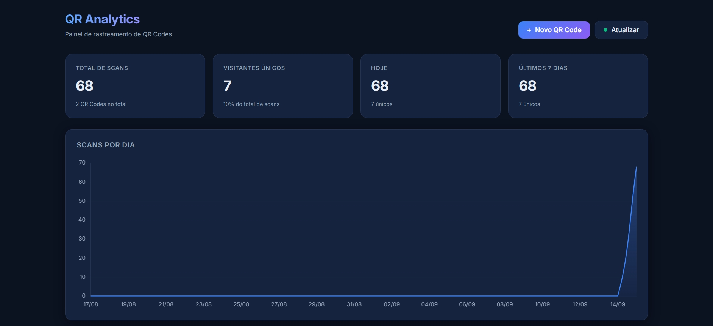
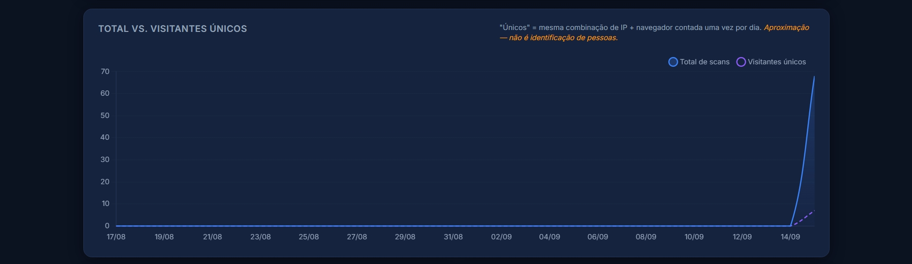
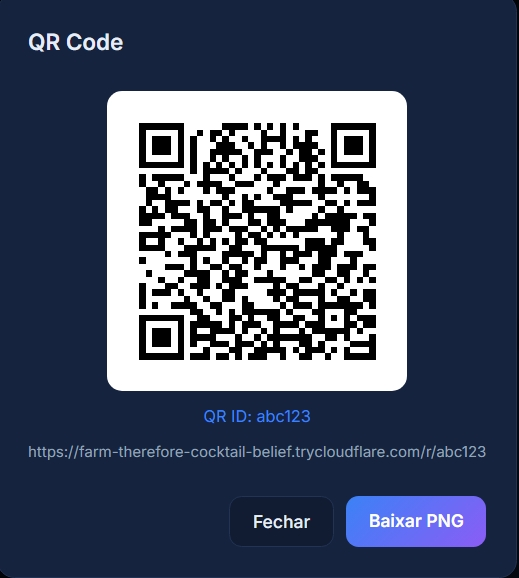

# QR Analytics

> Sistema de geração, rastreamento e análise de QR Codes — do zero ao dashboard.


## 📌 Sobre

O **QR Analytics** é uma aplicação full-stack que permite:

- **Gerar** QR Codes rastreáveis com URL própria
- **Rastrear** cada escaneamento — IP aproximado, cidade, dispositivo, navegador
- **Visualizar** os dados em um dashboard interativo com gráficos
- **Gerenciar** QR Codes (criar, editar, nomear campanha, excluir, baixar PNG)
- **Diferenciar** scans totais de visitantes únicos por dia

O projeto foi construído do zero, sem frameworks de dashboard ou templates prontos, com foco em **backend, segurança e análise de dados**.



## 🚀 Tecnologias

| Camada | Stack |
|---|---|
| **Backend** | Python 3.12, FastAPI, Uvicorn |
| **Banco de dados** | SQLite (com migrações leves automáticas) |
| **Frontend** | HTML, CSS, JavaScript vanilla, Chart.js |
| **Segurança** | HTTP Basic Auth, rate limiting (slowapi), headers CSP |
| **Deploy** | Cloudflare Tunnel |
| **Versionamento** | Git + GitHub |

📸 Screenshots
### Dashboard


### Visitantes únicos vs. totais


### Preview do QR Code


## ⚙️ Como rodar localmente

### Pré-requisitos

- Python 3.12+
- Git
- (Opcional) SQLite CLI para inspecionar o banco

### Passo a passo

```bash
# 1. Clonar
git clone https://github.com/Bruno140US/qr-analytics.git
cd qr-analytics

# 2. Criar ambiente virtual
python -m venv venv

# Windows:
venv\Scripts\activate

# Linux/macOS:
source venv/bin/activate

# 3. Instalar dependências
pip install -r backend/requirements.txt

# 4. Configurar variáveis de ambiente
# Windows:
copy .env.example .env

# Linux/macOS:
cp .env.example .env

# Edite o .env e troque ADMIN_PASSWORD

# 5. Subir a API
cd backend
uvicorn main:app --host 0.0.0.0 --port 8000 --reload


Acesse: http://localhost:8000/dashboard/

Login com as credenciais definidas no .env.

🌐 Colocando online (grátis, com HTTPS)
O projeto pode ser exposto à internet com Cloudflare Tunnel em poucos minutos:

powershell
# Em outro terminal, com a API rodando
cloudflared tunnel --url http://localhost:8000
O Cloudflare gera uma URL pública temporária do tipo https://xyz.trycloudflare.com. Testado com acesso via 4G — os scans são registrados com IP público e geolocalização real.

🔐 Segurança
Autenticação HTTP Basic em todos os endpoints administrativos

Rate limiting: 60 req/min por IP no endpoint público /r/{qr_id}

Headers de segurança: CSP, X-Frame-Options, X-Content-Type-Options, Referrer-Policy, Permissions-Policy

Validação de URL: bloqueia javascript:, data: e outros esquemas perigosos (anti open-redirect)

IP mascarado na API (191.32.108.x) — conformidade com LGPD

Retenção configurável de scans antigos

Queries parametrizadas contra SQL Injection

Ver LIMITACOES.md para o escopo coberto.

📊 Funcionalidades
☑ Gerar QR Code com URL rastreável
☑ Endpoint público de redirecionamento (/r/{qr_id})
☑ Registro de scans com IP, geolocalização aproximada, dispositivo, SO, navegador
☑ Detecção de dispositivo via User-Agent (iPhone, Android, Desktop, bot)
☑ Cache de geolocalização em SQLite (evita consultar API externa repetidamente)
☑ Dashboard com KPIs, gráfico temporal, dispositivos, cidades, navegadores
☑ CRUD de QR Codes pelo dashboard
☑ Analytics individual por QR Code
☑ Download do PNG do QR Code
☑ Visitantes únicos por dia (aproximação via hash de IP + User-Agent)
☑ Política de privacidade
☑ Página amigável quando o QR não existe
☑ Retenção automática de dados antigos
🧠 Decisões técnicas
SQLite em vez de Postgres: o escopo do projeto não exige concorrência alta; SQLite reduz atrito de setup para quem clona o repo.

Hash de visitante em vez de cookies: mais simples, sem rastreamento entre sites e compatível com LGPD.

Cloudflare Tunnel em vez de deploy em VM: gratuito, HTTPS automático, sem abrir portas no roteador.

Chart.js via CDN: evita etapa de build no frontend.

### No celular


No celular

👤 Autor
Bruno Rocha

GitHub: @Bruno140US